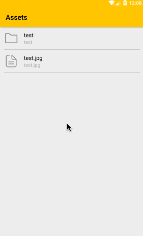

# AssetsFile
更方便的操作Assets资源



### Gradle
```
implementation 'com.dyhdyh.io:asset-file:1.0.2'
```

### AssetFile
使用方法跟`java.io.File`相似  

```
//创建AssetFile
new AssetFile();

new AssetFile(assetPath);

new AssetFile(parent, child);

//获取完整路径
assetFile.getAssetPath();

//获取文件名称或目录名称
assetFile.getName();

//获取父级目录
assetFile.getParentFile();

//转换Uri
assetFile.getUri();

//是否文件夹
assetFile.isDirectory(getAssets());

//是否根目录
assetFile.isRootDir();

//文件是否存在
assetFile.exists(getAssets());

//获取目录下的文件数组
assetFile.listFiles(getAssets());
```


### AssetsManager
```
//从asset复制文件到手机目录
AssetsManager.copyAssetFile(context, assetFile, saveFile);

//从asset复制文件夹或文件到手机目录
AssetsManager.copyAsset(context, assetFile, saveDir);
```
